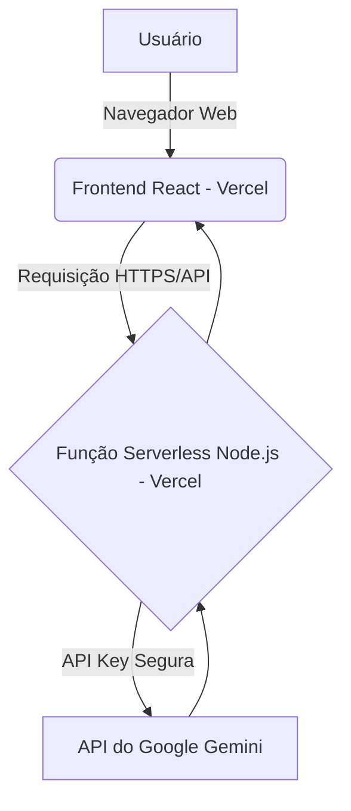

# Arquitetura Full-Stack: Analisador de Respostas LAI

## 1. Introdução

Este documento descreve a arquitetura full-stack para o projeto **Analisador de Respostas LAI**. Ele serve como a fonte única de verdade técnica para guiar o desenvolvimento, garantindo consistência entre o frontend, backend e a infraestrutura.

### Starter Template
N/A - Projeto Greenfield.

### Change Log
| Date       | Version | Description              | Author  |
|------------|---------|--------------------------|---------|
| 2025-09-17 | 1.0     | Versão inicial baseada no PRD | Winston |

---

## 2. Arquitetura de Alto Nível

### Resumo Técnico

A arquitetura será baseada no padrão **Jamstack**. O frontend será uma Single-Page Application (SPA) construída com **React (Vite)**, servida estaticamente. O backend consistirá em uma **função serverless Node.js** que orquestra a chamada para a API do Gemini. A plataforma escolhida é a **Vercel**, que oferece hospedagem de frontend e execução de funções serverless de forma integrada, otimizando a performance e simplificando o CI/CD.

### Plataforma e Infraestrutura
- **Plataforma:** Vercel
- **Serviços Chave:** Hospedagem de Assets Estáticos (Frontend), Funções Serverless (Backend), Vercel KV (para cache, se necessário).
- **Regiões de Deploy:** Leste dos EUA (padrão Vercel).

### Estrutura do Repositório
- **Estrutura:** Monorepo
- **Ferramenta:** npm workspaces
- **Organização:** Uma estrutura simples de `apps/` contendo `web` (frontend) e `api` (backend).

### Diagrama da Arquitetura


### Padrões Arquiteturais
- **Jamstack:** Para alta performance e segurança do frontend.
- **Serverless:** Para o backend, garantindo escalabilidade e baixo custo, pagando apenas pelo uso.
- **Component-Based UI:** Utilizando React para criar uma interface modular e reutilizável.

---

## 3. Tech Stack

| Category             | Technology         | Version | Purpose                                          |
|----------------------|--------------------|---------|--------------------------------------------------|
| Frontend Language    | TypeScript         | ~5.2    | Tipagem estática para robustez.                  |
| Frontend Framework   | React              | ~18.2   | Biblioteca padrão de mercado para SPAs.          |
| UI Component Library | Tailwind CSS       | ~3.4    | Framework utility-first para design rápido.      |
| Backend Language     | TypeScript         | ~5.2    | Consistência com o frontend.                     |
| Backend Framework    | Express.js         | ~4.18   | Framework minimalista para a função serverless.  |
| API Style            | REST               | N/A     | Padrão simples para a comunicação interna.       |
| Frontend Testing     | Vitest + RTL       | latest  | Testes unitários e de componentes.               |
| Backend Testing      | Vitest             | latest  | Testes unitários para a lógica da função.        |
| Build Tool           | Vite               | ~5.2    | Build tool moderna e extremamente rápida.        |
| CI/CD                | Vercel             | N/A     | Integração contínua e deploy integrados.         |

---

## 4. Estrutura Unificada do Projeto

```plaintext
analisador-lai/
├── apps/
│   ├── api/                # Backend (Função Serverless)
│   │   ├── src/
│   │   │   └── index.ts    # Ponto de entrada da função
│   │   ├── package.json
│   │   └── tsconfig.json
│   └── web/                # Frontend (React + Vite)
│       ├── public/
│       ├── src/
│       │   ├── components/ # Componentes React
│       │   ├── App.tsx
│       │   └── main.tsx
│       ├── index.html
│       ├── package.json
│       └── tsconfig.json
├── package.json            # Raiz do monorepo (npm workspaces)
└── README.md
```

---

## 5. Padrões de Código

- **Variáveis de Ambiente:** Nunca expor chaves de API no frontend. A chave do Gemini deve ser acessada exclusivamente pela função serverless no backend, via variáveis de ambiente da Vercel.
- **Tipagem:** Usar TypeScript em modo `strict`.
- **Nomenclatura:**
    - Componentes React: `PascalCase` (ex: `FormularioAnalise.tsx`)
    - Funções e variáveis: `camelCase` (ex: `handleAnalise`)

---

## 6. Estratégia de Testes

- **Frontend:** Foco em testes de componentes com React Testing Library (RTL) para validar a renderização e interação do usuário.
- **Backend:** Testes unitários com Vitest para a lógica de negócio dentro da função serverless, usando mocks para a chamada à API do Gemini.
