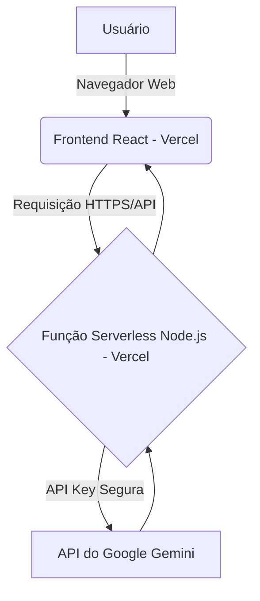

# 2. Arquitetura de Alto Nível

## Resumo Técnico

A arquitetura será baseada no padrão **Jamstack**. O frontend será uma Single-Page Application (SPA) construída com **React (Vite)**, servida estaticamente. O backend consistirá em uma **função serverless Node.js** que orquestra a chamada para a API do Gemini. A plataforma escolhida é a **Vercel**, que oferece hospedagem de frontend e execução de funções serverless de forma integrada, otimizando a performance e simplificando o CI/CD.

## Plataforma e Infraestrutura
- **Plataforma:** Vercel
- **Serviços Chave:** Hospedagem de Assets Estáticos (Frontend), Funções Serverless (Backend), Vercel KV (para cache, se necessário).
- **Regiões de Deploy:** Leste dos EUA (padrão Vercel).

## Estrutura do Repositório
- **Estrutura:** Monorepo
- **Ferramenta:** npm workspaces
- **Organização:** Uma estrutura simples de `apps/` contendo `web` (frontend) e `api` (backend).

## Diagrama da Arquitetura

## Padrões Arquiteturais
- **Jamstack:** Para alta performance e segurança do frontend.
- **Serverless:** Para o backend, garantindo escalabilidade e baixo custo, pagando apenas pelo uso.
- **Component-Based UI:** Utilizando React para criar uma interface modular e reutilizável.

---
